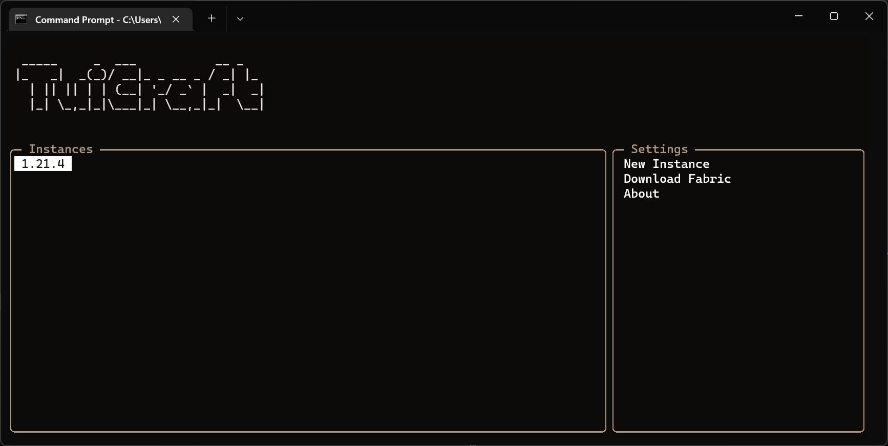

# **TuiCraft**

A simple Text-based User Interface (TUI) to manage and run offline Minecraft. Easily create instances of any Minecraft version.



---

## **Features**
- Create and manage multiple Minecraft instances.
- Minimalistic TUI design for quick and easy navigation.
- Lightweight and dependency-friendly.

---

## **Getting Started**

### **1. Clone the Repository**
Clone the project to your local machine:

```bash
git clone https://github.com/IntelAkaLake/TuiCraft.git
cd TuiCraft
```

### **2. Install Dependencies**
Ensure Python is installed, then install the required dependencies:

```bash
pip install -r requirements.txt
```

### **3. Run the Application**
Launch the TUI application:

```bash
python main.py
```

---

## **Contributing**
Contributions are welcome! If you encounter a bug or have an idea for a feature, feel free to:
1. Fork the repository.
2. Create a feature branch.
3. Submit a pull request.

---

## **License**
This project is licensed under the GNU General Public License v3.0. See the [LICENSE](LICENSE) file for more details.

---

## **TODO**
- ~~Refresh Instances (Doesn't work)~~ done in v0.2.0-alpha
- Manage Instances by shortcut
- Edit Username (Default: User)
- Make Fabric download by shortcut on the focused Instance
- ~~Make "About" open our GitHub link~~ done in v0.2.0-alpha
- ~~LAST:~~ Mod/Texture menu
